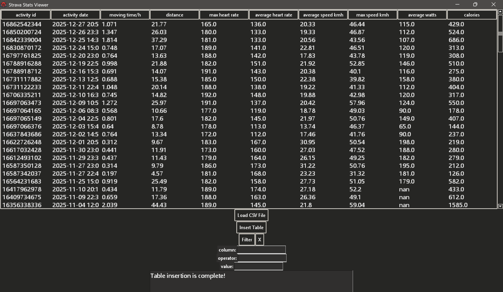

Strava statistics reading app. App is made for cycling in mind but does work for other activities, though vital stats may not display without modifications. It visualizes similar to Excel but more concise without excessive data like "Sun Set Time" or "Temperature".

INSTRUCTIONS:

    1. Download your data from Strava

        Strava Settings>My Account>Download Data>Download Request (Will be sent to your mail)

    2. It should download "export_xxxxx" like a ZIP file, extract it.

    3. From the app, click Load CSV file and choose "activities.csv"

    4. Click on insert table, done!

